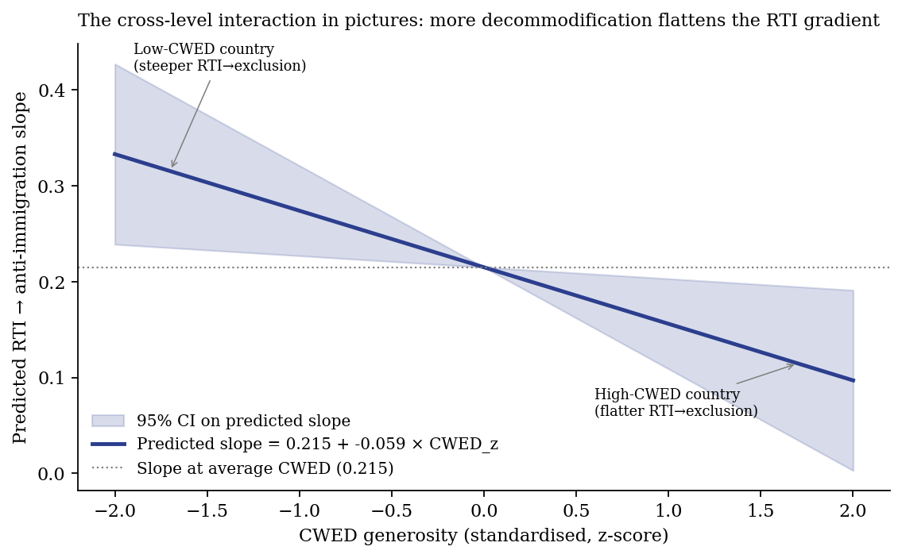
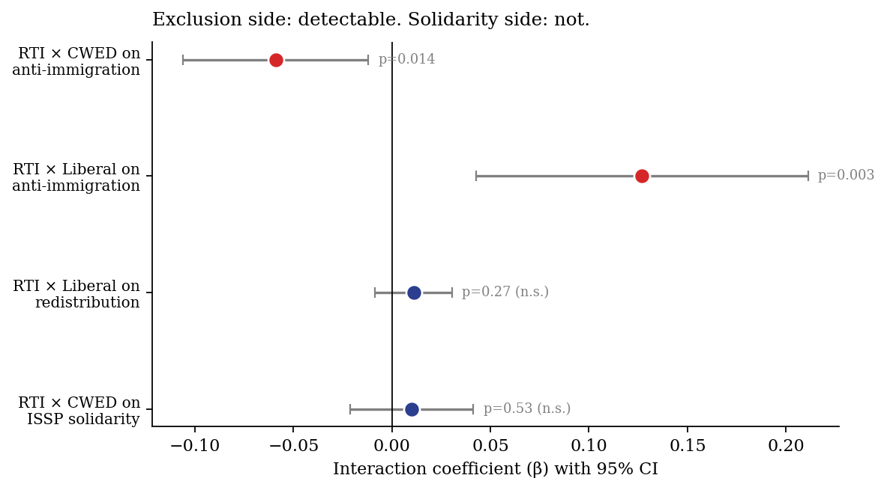
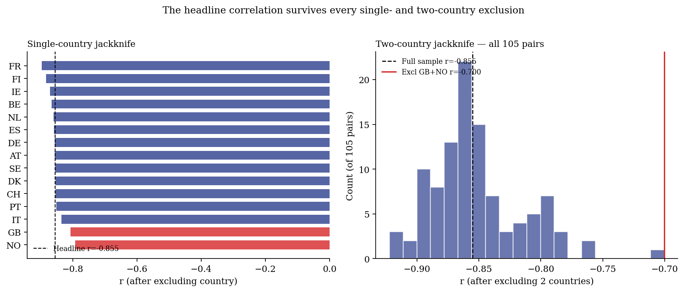
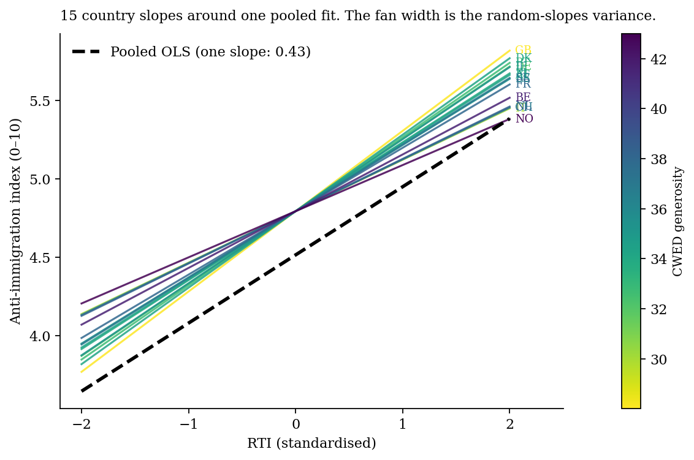
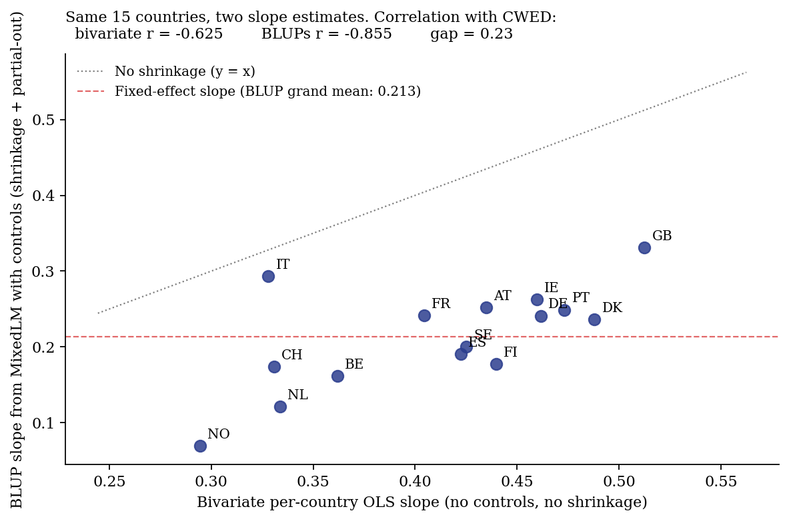
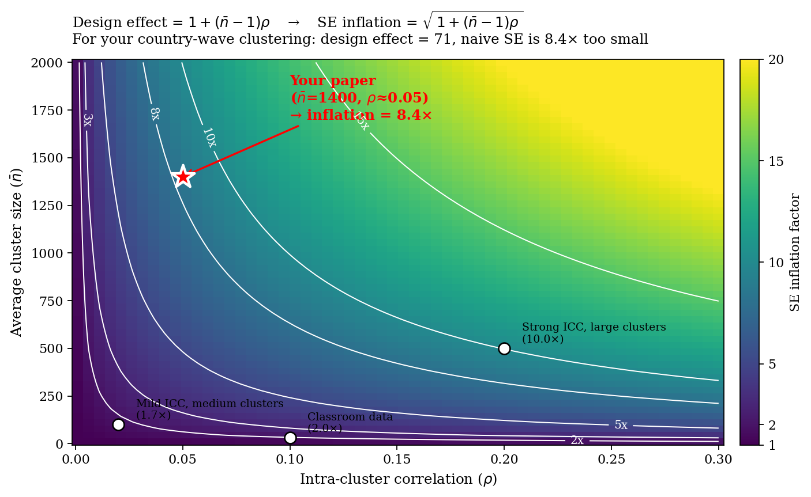

## {.center}

::: {style="text-align: center; padding-top: 1.2em;"}

# Dignity Is a Baseline {.larger}

### Welfare Institutions and the Asymmetric Politics of Economic Disruption

<br/><br/>

**Ben Smart**

University of Copenhagen — Department of Economics

::: {.smaller}

*Welfare State Seminar — 4 May 2026*

:::

:::

::: {.notes}
[~20 sec]

Good afternoon. The thirty-second version: workers exposed to automation are
more anti-immigration than their material interests would predict. The gap is
bigger in some welfare states than others. The conventional explanation —
welfare buffers the backlash — is wrong about the mechanism. The mechanism is
asymmetric. I'll show you why.
:::

---

## The puzzle

::: {.columns}

::: {.column width="55%"}

::: {}

**Robust empirical regularity:**

Workers in routine-task-intensive (RTI) occupations across Europe disproportionately support populist radical right parties

::: {.smaller}

Gingrich (2019); Kurer (2020); Im et al. (2019); Autor et al. (2020); Gallego & Kurer (2022)

:::

:::

::: {}

**Cross-national variation:**

The same automation exposure converts into anti-immigration sentiment more readily in some welfare states than others

::: {.smaller}

Vlandas & Halikiopoulou (2022); Caselli et al. (2021)

:::

:::

:::

::: {.column width="45%"}

::: {}

::: {.callout-note title="The standard reading" appearance="simple"}

**Welfare buffers the backlash.**

Spend more, get less populism.

:::

:::

::: {}

::: {.callout-important title="My claim" appearance="simple"}

**The standard reading is missing the mechanism.**

What welfare *communicates* matters more than what welfare *spends*.

:::

:::

:::

:::

::: {.notes}
[~75 sec]

Two things are well documented. RTI workers vote radical right. The pattern
varies across welfare states.

The dominant explanation: welfare buffers the backlash. Quantity-based.
Compensation as cushion.

I'll argue today this account is missing the mechanism. Not wrong that welfare
matters; wrong about how. The dimension that matters is what welfare
communicates, not what it spends.
:::

---

## The literature is split — and asks the wrong question

::: {.columns}

::: {.column width="48%"}

::: {.callout-warning title="The buffering account" appearance="simple"}

**Operative variable: quantity.** More welfare spending → less populism (Ruggie's embedded liberalism bargain — compensation dampens political insecurity).

::: {.smaller}

- Vlandas & Halikiopoulou; Ennser-Jedenastik
- Burgoon & Schakel (2022) — welfare generosity ↓ anti-globalisation rhetoric in party platforms
- **Three streams pushing back:**
  - Gingrich (2019): no weaker automation→populism effect in generous regimes
  - Stutzmann (2025): German coal phase-out compensated, abstention rose anyway
  - Pelc (2025): workers refuse compensation that fully replaces income

:::

:::

:::

::: {.column width="4%"}
:::

::: {.column width="48%"}

::: {.callout-important title="The recognition challenge" appearance="simple"}

**Operative variable: what welfare *says*.** Recognition isn't fungible with redistribution.

::: {.smaller}

> *"Traditional welfare policy may be an insufficient response... when relative societal decline rather than material hardship are at the heart of socially conservative resentment."*
> — **Kurer (2020)**

> *"They demand economic and cultural protection."*
> — **Kurer & Palier (2019)**

> *"Care as much, or even more, about recognition as about redistribution."*
> — **Gidron & Hall (2017)**

:::

:::

:::

:::

::: {.smaller .fragment style="text-align: center; margin-top: 0.6em; font-style: italic;"}

Both literatures see real patterns. Neither captures the asymmetry. The damage cascade I'm about to describe is what reconciles them — by identifying *which dimension of welfare design* (quantity vs quality) the political effects actually travel along.

:::

::: {.notes}
[~90 sec — combined]

Two literatures speak past each other. Buffering: Ruggie's compensation as
quantity. More spending dampens populism. The literature has Vlandas,
Halikiopoulou, Burgoon and Schakel.

But three streams push back. Gingrich's cross-national: generous welfare
states don't show weaker automation-to-populism effects. Stutzmann's German
coal phase-out: compensated communities had higher abstention. Pelc: workers
refuse compensation even when it fully replaces income.

The recognition literature has been naming what's missing. Kurer: traditional
welfare may be insufficient when relative decline drives resentment.
Kurer-Palier: workers demand economic AND cultural protection. Gidron and
Hall: right-populist voters care about recognition as much as redistribution.

Both literatures see real patterns. Neither captures the asymmetry. My
asymmetric mechanism is what reconciles them — by identifying which dimension
of welfare design the political effects travel along: quantity, or what
welfare communicates.
:::

---

## The argument {.center-content}

::: {style="text-align: center;"}

### Welfare institutions are *asymmetric* in their political effects

:::

<br/>

::: {.columns}

::: {.column width="50%"}

::: {.callout-important title="They can fail" appearance="default"}

By degrading the self-concept of workers in vulnerable positions, conditioning a documented chain of psychological responses to engage in sequence.

:::

:::

::: {.column width="50%"}

::: {.callout-tip title="They cannot symmetrically succeed"}

Producing solidarity requires constructive political work that welfare design alone cannot do.

The mirror-image mechanism does not exist.

:::

:::

:::

::: {}

::: {style="text-align: center; font-size: 1.05em; padding-top: 0.5em;"}

**Dignity is a baseline good. Its absence damages. Its presence clears the ground for solidarity without producing it.**

:::

:::

::: {.notes}
[~90 sec — central slide, slow down]

The argument. Welfare's political effects are asymmetric.

They can fail politically by damaging the self-concept of vulnerable workers,
through a cascade I'll detail in a moment. They cannot, by symmetric operation,
succeed.

[Pause. Point to the navy thesis box.]

Dignity is a baseline good. Its absence damages. Its presence clears the ground
for solidarity *without producing it*.

That last sentence is the paper's title in compressed form. It's also the move
that distinguishes this paper from the buffering literature it's responding to.
:::

---

## Why welfare and not something else?

::: {style="text-align: center; font-size: 0.95em; font-style: italic; color: #444; padding: 0.5em 0;"}

Many institutions shape identity. Why isolate welfare?

:::

::: {}

::: {style="text-align: center; padding: 0.6em 0; font-size: 1.05em;"}

**Welfare is the single state domain where economic vulnerability and institutional treatment meet at the same moment.**

:::

:::

::: {}

| Institution | Allocates resources? | Renders judgement? |
|:---|:---:|:---:|
| Courts | rarely | yes |
| Markets | yes | no (or pretends not to) |
| Religious institutions | no (cannot compel) | yes |
| **Welfare** | **yes** | **yes — at the point of maximum material dependence** |

:::

::: {.notes}
[~60 sec]

A reasonable objection: lots of institutions shape identity. Media construct
group boundaries. Religious traditions supply moral narratives. Class
structures generate interest coalitions. Why isolate welfare?

The answer is that welfare is the single state domain where economic
vulnerability and institutional treatment meet at the same moment.

When a worker encounters the welfare state, the institution allocates
resources *and* renders judgement about the worker's claim to those resources,
in the same act.

Courts judge but rarely allocate. Markets allocate without judgement, or
pretend to. Religious institutions judge but cannot compel. Only welfare does
both, at the point of maximum material dependence.
:::

---

## The damage cascade

```{mermaid}
%%| fig-width: 11
%%{init: {'theme':'base', 'themeVariables': {'primaryColor':'#e8eef9', 'primaryTextColor':'#0b3d91', 'primaryBorderColor':'#0b3d91', 'lineColor':'#c9302c', 'fontFamily':'Source Sans Pro, sans-serif', 'fontSize':'15px'}, 'flowchart': {'curve':'linear', 'nodeSpacing':22, 'rankSpacing':30}}}%%
flowchart LR
    A["Stigmatising<br/>welfare<br/>encounter"] --> B["Class identity<br/>damaged"]
    B --> C["Cultural identity<br/>activated"]
    C --> D["Grievance<br/>misattributed"]
    D --> E["Defensive<br/>othering"]
    E --> F["Particularistic-<br/>authoritarian<br/>preference"]
    classDef damage fill:#fff5e1,stroke:#c9302c,stroke-width:2px,color:#1a1a1a
    classDef origin fill:#e8eef9,stroke:#0b3d91,stroke-width:2px,color:#0b3d91
    classDef final fill:#c9302c,stroke:#7a1d1d,stroke-width:2px,color:#fff
    class A origin
    class B,C,D damage
    class E,F final
```

::: {.columns}

::: {.column width="55%"}

::: {style="background: #f6f8fa; padding: 0.6em 0.9em; border-radius: 4px; border-left: 4px solid #0b3d91; font-size: 0.78em;"}

**Each step independently documented:**

Soss (1999), Wagner (2022) · Bonomi, Gennaioli & Tabellini (2021) · Wu (2022); Ballard-Rosa et al. (2022) · Patrick (2016) · Busemeyer, Rathgeb & Sahm (2022)

:::

:::

::: {.column width="45%"}

::: {style="background: #fff5e1; padding: 0.6em 0.9em; border-radius: 4px; border-left: 4px solid #c9302c; font-size: 0.78em;"}

**My contribution:**

These steps form a *connected* sequence. Welfare *design* is the institutional condition determining whether they engage together.

:::

:::

:::

::: {.notes}
[~120 sec — central mechanism slide]

Three responses follow when welfare institutions damage the self-concept. Each
builds on, and is harder to reverse than, the one before.

[Trace left to right.]

Stigmatising implementation degrades class identity directly. Soss on welfare
implementation, Wagner on dignity injuries.

Class identity damaged, cultural identity activates. Bonomi, Gennaioli and
Tabellini model this exactly: individuals move from class to cultural identity
when class identity is degraded by economic disruption.

Once cultural identity is in charge, grievances misattribute. Wu shows this
empirically: workers at higher automation risk oppose immigration, but show no
different technology preferences. The misdirection has no protective analogue.

The third move is defensive: othering. Patrick documents UK benefit claimants
shoring up their own deservingness through critique of those below them, using
the welfare system's own criteria. Wagner calls this "kicking down."

The cascade ends in what Busemeyer, Rathgeb and Sahm call the
*particularistic-authoritarian* welfare preference: pro-workfare, anti-poor,
anti-social-investment. The political programme of a self-concept the welfare
state has helped construct.

Each step has its own literature. What's mine is the connection — that these
mechanisms are linked, that welfare design is the institutional condition
under which they engage together, that no symmetric protective mechanism
exists with comparable evidence.
:::

---

## Why no symmetric mirror image — three reasons

::: {.columns}

::: {.column width="33%"}

::: {style="background: #f6f8fa; padding: 0.8em; border-radius: 4px; height: 100%;"}

**1. Loss aversion**

::: {.smaller}

Kahneman & Tversky (1979): losses loom larger than equivalent gains.

A stigmatising encounter registers as status loss. A dignity-preserving one registers as the *absence* of damage.

Damage mobilises; absence of damage tends not to.

:::

:::

:::

::: {.column width="33%"}

::: {style="background: #f6f8fa; padding: 0.8em; border-radius: 4px; height: 100%;"}

**2. Status is positional**

::: {.smaller}

Recognition cannot be redistributed without losses to the currently-recognised *(Gidron & Hall 2017)*.

Dignity-preserving welfare *removes an obstacle* to inclusive solidarity.

It does not, by itself, *construct* the inclusion.

:::

:::

:::

::: {.column width="33%"}

::: {style="background: #f6f8fa; padding: 0.8em; border-radius: 4px; height: 100%;"}

**3. Investments are sticky**

::: {.smaller}

Once a worker has built deservingness on critique of those below, the identity investment is costly to reverse.

Pierson's (1994) positive feedback runs *forward* into support; the cascade runs forward into harder-to-reverse opposition.

*Caveat: this is the strongest theoretical claim and least directly tested.*

:::

:::

:::

:::

::: {.notes}
[~75 sec]

Three reasons the mechanism runs only one way.

First, loss aversion. Damage psychologically heavier than equivalent
non-damage. This applies to dignity shocks just as material ones.

Second, status is positional. Recognition can't be redistributed the way money
can. Welfare clears space for inclusive solidarity but doesn't construct it.

Third — and the one I find theoretically most interesting and *least directly
tested* — defensive othering, once committed to, is costly to reverse.
Pierson's positive feedback runs forward into support; the damage cascade runs
forward into opposition that gets harder to reverse with each iteration. Worth
flagging this is more conjecture than the other two.
:::

---

## Empirical setup

::: {.columns}

::: {.column width="50%"}

**Data**

- European Social Survey rounds 6–9 (2012–2018)
- 34 countries, **N = 188,764**
- 15 Western European countries in the welfare-quality comparison

**Identification strategy**

- Cross-level interactions: RTI × Welfare → attitudes
- Country-wave fixed effects, cluster-robust SEs
- Random-slope mixed models

:::

::: {.column width="50%"}

**Two competing welfare measures**

::: {style="background: #f6f8fa; padding: 0.8em; border-radius: 4px; margin-top: 0.5em;"}

**ALMP spending (% GDP)** — what the buffering literature uses

Captures welfare *effort*

:::

::: {style="background: #f6f8fa; padding: 0.8em; border-radius: 4px; margin-top: 0.5em;"}

**CWED decommodification** — Esping-Andersen index

Captures the degree to which workers can sustain themselves *without dependence on the market*

:::

::: {.smaller .fragment}

The asymmetric mechanism predicts **ALMP should fail to predict the slope; CWED should predict it strongly.**

:::

:::

:::

::: {.smaller style="color: #888; margin-top: 0.4em; font-style: italic;"}
Random-slopes specification justified by likelihood-ratio test against random-intercepts (χ² &gt; 90, df=2, p &lt; 10⁻²⁰); full diagnostic in appendix.
:::

::: {.notes}
[~60 sec]

ESS rounds 6 to 9, 34 countries, N=188,764. The headline analysis restricts to
the 15 Western European countries with CWED welfare-quality data.

Cross-level interactions, country-wave fixed effects, cluster-robust SEs.
Cross-sectional design — claim is consistency with the asymmetric mechanism,
not causation.

Two competing welfare measures: ALMP spending, what the buffering literature
typically uses; CWED decommodification, the Esping-Andersen index.

The asymmetric mechanism makes a sharp prediction: ALMP shouldn't predict the
slope; CWED should.
:::

---

## Empirical strategy — what is identified, and which test is the strongest

::: {.columns}

::: {.column width="50%"}

**The model — cross-level interaction with random slopes**

::: {style="font-size: 0.78em;"}

$$\begin{aligned}
Y_{ij} = {} & \beta_0 + \beta_1\text{RTI}_i + \beta_2 W_j + \color{#c9302c}{\beta_3(\text{RTI}_i \times W_j)} \\
& + \gamma\mathbf{X}_i + u_j + u_{1j}\text{RTI}_i + \varepsilon_{ij}
\end{aligned}$$

:::

::: {.smaller}

- $\beta_3$ — the parameter of interest: how welfare context moderates the RTI→exclusion conversion
- $u_{1j}$ — random slope for RTI at country-wave level (LR test χ² > 90 vs random intercepts)
- $\gamma\mathbf{X}_i$ — individual controls (age, gender, education, income, urban)
- Cross-sectional design: claim is *consistency*, not causation

:::

:::

::: {.column width="50%"}

**The hierarchy of evidence**

::: {.callout-tip title="Primary test — formally identified" appearance="simple"}

**Model 3 (individual-level, N ≈ 82,000)**
β₃ = **−0.059, p = 0.015**
The interaction estimated jointly across all individuals, with random slopes and cluster-robust SEs.

:::

::: {.callout-note title="Visual companion — illustration" appearance="simple"}

**Country-level scatter (N = 15)**
r = **−0.85, p < 0.001**
The picture that explains *why* the interaction exists — not the primary evidence that it does.

:::

::: {.callout-warning title="Robustness — methodology-symmetric" appearance="simple"}

**OLS + country-wave FE + clustered SE**
Directionally identical estimates. Three independent methodologies converge.

:::

:::

:::

::: {.smaller style="margin-top: 0.4em; font-style: italic; color: #666; text-align: center;"}
The country-level r = −0.85 is striking but rests on N=15. Lead with Model 3 as the formally identified test; treat the scatter as the picture.
:::

::: {.notes}
[~60 sec — empirical strategy and the hierarchy of claims]

The model is a cross-level interaction with random slopes. β₃ — the
RTI-times-welfare interaction — is the parameter of interest. Random slopes
for RTI at the country-wave level, justified by the LR test. Individual
controls. Country-wave fixed effects in the OLS robustness check.
Cross-sectional design — the claim is consistency with the asymmetric
mechanism, not causation.

Hierarchy of evidence — and this is the framing point. The primary test is
Model 3, the individual-level cross-level interaction estimated on roughly
82,000 individuals. β₃ equals minus point zero five nine, p equals point zero
one five. Formally identified, conservative SE under random slopes.

The country-level r equals minus point eight five on N equals 15 is the
visual companion — the picture that explains why the interaction exists. Not
the primary evidence that it does. The hierarchy matters; lead with Model 3
when you defend the result.

OLS plus country-wave fixed effects plus clustered SE runs as parallel
robustness. Three methodologies, directionally identical. That convergence is
the cross-validation.
:::

---

## What the cross-level interaction asks

::: {.columns}

::: {.column width="58%"}

{fig-align="center" width="100%"}

:::

::: {.column width="42%"}

**Reading the fan**

Each country sits on a point of the line. Move CWED → the predicted RTI-slope changes.

::: {.smaller}

| Country (CWED *z*-score) | Predicted slope |
|---|---|
| UK (*z* ≈ −2) | **0.333** |
| Average | 0.215 |
| Norway (*z* ≈ +2) | **0.097** |

:::

::: {.fragment .callout-note appearance="simple"}

**β₃ < 0** would mean: more decommodifying welfare *flattens* the conversion of RTI into anti-immigration attitudes. That's the test.

:::

:::

:::

::: {.notes}
[~50 sec — visual setup before the headline]

Before the data: what the cross-level interaction is asking. β₃ is the rate at
which the slope of RTI on anti-immigration changes per one-SD of CWED.

A negative β₃ means: each one-SD increase in welfare decommodification reduces
the RTI-to-exclusion conversion by some amount. The fan visualises this. Each
country sits on a point of the line. UK at the steep end with predicted slope
zero point three three; Norway at the flat end with zero point one. The total
spread across the observed CWED range is roughly point two four scale points
per SD of RTI.

The asymmetric mechanism predicts negative β₃. The buffering account, in its
spending-effort form, would predict the same negative interaction on ALMP. We
test both next.
:::

---

## Cross-national pattern: 5 regimes

{fig-align="center" width="78%"}

::: {.smaller .fragment}

**Liberal regime slope steepest (β=0.512); Nordic flattest (β=0.413).** Same RTI exposure, different conversion into exclusion. The cross-national variation to be explained.

:::

::: {.notes}
[~60 sec]

The cross-national pattern by regime. Each panel is a welfare regime; line is
RTI predicting anti-immigration. Liberal steepest at point five one two.
Nordic flattest at point four one three. The same routine-task exposure
converts into anti-immigration sentiment more readily in some regimes than
others. This is the variation the paper needs to explain. The buffering reading
predicts more spending → flatter slope. We test this directly next.
:::

---

## Marginal effects: the gap, in scale points

{fig-align="center" width="62%"}

::: {.columns}

::: {.column width="60%"}

::: {.callout-important appearance="simple"}

A **1-SD increase in RTI** is associated with **0.32** additional scale points of anti-immigration sentiment in **Liberal** regimes versus **0.20** in **Nordic** regimes — a 60% steeper conversion at the same exposure level.

:::

:::

::: {.column width="40%"}

::: {.smaller}

The cross-regime gap is statistically significant ($\beta_{\text{RTI}\times\text{Liberal}} = +0.127, p = 0.003$ vs Nordic baseline) and survives every robustness check: country-wave FE, individual-level controls, jackknife exclusion of any single country.

:::

:::

:::

::: {.notes}
[~45 sec — concrete substantive bridge]

Same data, translated into substantive scale points. A one-standard-deviation
increase in RTI is associated with point three two additional scale points of
anti-immigration sentiment in Liberal regimes versus point two in Nordic
regimes. The Liberal slope is sixty percent steeper at the same exposure
level. The cross-regime gap is statistically significant — interaction beta
point one two seven, p equals point zero zero three. So the regime variation
isn't just a visual pattern; it's a substantive one. The next slide identifies
which dimension of welfare variation actually predicts that gap.
:::

---

## The empirical headline: ALMP vs CWED

{fig-align="center" width="68%"}

::: {.columns}

::: {.column width="50%"}

::: {.callout-warning title="ALMP spending" appearance="simple"}

**r = +0.01**, p = 0.97 (n.s.)

Spending effort is *uncorrelated* with the cross-national slope.

:::

:::

::: {.column width="50%"}

::: {.callout-important title="CWED decommodification" appearance="simple"}

**r = −0.85**, p < 0.001

Decommodification accounts for **72%** of cross-national variation.

:::

:::

:::

::: {.smaller style="color: #666; margin-top: 0.6em; font-style: italic;"}
Country-level slopes are BLUPs from a random-slopes mixed model with individual-level controls (full methodology in appendix). Same slope methodology used for both ALMP and CWED panels. CWED correlation survives single-country exclusion (worst case r=−0.79) and joint UK+Norway exclusion (r=−0.71, p=0.006).
:::

::: {.notes}
[~90 sec — empirical highlight]

This is the paper's most important empirical contrast. Same fifteen Western
European countries, two ways of measuring welfare.

ALMP spending: r equals plus point zero one. Essentially zero. Spending more
on labour market policies has nothing to do with the cross-national pattern.

CWED decommodification: r equals negative point eight five. Seventy-two
percent of the cross-national variation. UK lowest, Norway highest. Exactly
what the asymmetric mechanism predicts and what the buffering account cannot
explain.

The difference between the measures is what matters. ALMP captures effort.
You can spend a lot on punitive workfare. CWED captures decommodification —
what the welfare state lets you have, not what it costs to provide. Dignity
travels along the second variable.
:::

---

## Decomposing CWED: which dimension carries the signal?

{fig-align="center" width="92%"}

::: {.columns}

::: {.column width="55%"}

::: {style="font-size: 0.78em;"}

| Component | β | p |
|-----------|---|---|
| **Unemployment** | **−0.053** | **<0.001** |
| Sickness | −0.037 | 0.003 |
| Pensions | −0.019 | 0.066 |
| Composite | −0.051 | <0.001 |

Individual-level RTI × component on anti-immigration. N = 81,887; country-wave FE; cluster-robust SEs.

:::

:::

::: {.column width="45%"}

::: {.callout-important appearance="simple"}

**Theory predicts UE > SK > PEN.** ✓ confirmed at individual level. The damage cascade fires through *the point of vulnerability*.

:::

:::

:::

::: {.notes}
[~75 sec — new finding]

Decomposing CWED into three sub-components: unemployment generosity, sickness,
pensions. Theory predicts unemployment should drive the result — that's where
automation-exposed routine workers actually meet the welfare state. Pensions
are decoupled from working-age dignity dynamics.

Individual-level interactions: unemployment beta minus zero point zero five
three, p less than point zero zero one. Sickness intermediate. Pensions
weakest, marginally significant only.

Predicted ordering UE greater than SK greater than PEN. Observed at individual
level: same. The asymmetric mechanism's specific prediction holds.

For thesis design: this means the within-Denmark test should focus on
unemployment benefit reforms — 2003, 2006, 2013 activation reforms. Pension
reforms shouldn't show damage signatures of the same magnitude.
:::

---

## Same data, opposite outcome — the asymmetric confirmation

::: {.columns}

::: {.column width="55%"}

{fig-align="center" width="100%"}

::: {.smaller style="font-style: italic; color: #666;"}
Four interaction coefficients on the same data. The exclusion side (red) is detectable; the solidarity side (blue) sits on zero. ISSP 2006 confirms the solidarity null on a different sample, outcome, and time period.
:::

:::

::: {.column width="45%"}

::: {.callout-important appearance="simple"}

**Exclusion side is robust.**
**Solidarity side is null.**

:::

**Why this isn't a measurement failure:**

::: {.smaller}

- Same data, same estimator, comparable specification detected the exclusion moderation cleanly.

- ISSP 2006 (different sample, outcome, period): RTI × CWED on unemployment spending → β = +0.010, p = 0.55. **Same null.**

- *Welfare context cleanly attenuates conversion into exclusion. It does not detectably moderate conversion into solidarity.*

- This is what the asymmetric mechanism predicts on three separate grounds: loss aversion, positional status, irreversibility of identity investments.

:::

::: {.smaller style="color: #888; font-style: italic; margin-top: 0.6em;"}
Power to detect a solidarity moderation of equal magnitude to the exclusion finding exceeds 0.99. Power isn't the binding constraint.
:::

:::

:::

::: {.notes}
[~75 sec]

Same data tested two ways. RTI predicts anti-immigration more strongly in
Liberal regimes than Nordic — interaction beta point one two seven, p equals
point zero zero three. Robust across every specification.

RTI also predicts slightly higher redistribution support across all regimes —
but the cross-regime variation in that pathway is small, non-significant, and
in the wrong direction.

Welfare context attenuates conversion into exclusion. It does not detectably
moderate conversion into solidarity.

Two ways to read the null. As measurement limitation, or as substantive
confirmation. The supplementary ISSP test on different data with different
outcome returns the same null. I take the substantive reading. It's what the
theory predicts.
:::

---

## Robustness — what survives

::: {.columns}

::: {.column width="58%"}

{fig-align="center" width="100%"}

::: {.smaller style="font-style: italic; color: #666;"}
Single-country jackknife (left) and full two-country jackknife distribution across all 105 pairs (right).
:::

:::

::: {.column width="42%"}

::: {.callout-tip title="Single-country exclusion" appearance="simple"}

r ranges from **−0.79 to −0.85** across all 15 single-country exclusions. **Sign-stable.** Never crosses zero.

:::

::: {.callout-tip title="Two-country exclusion (worst case)" appearance="simple"}

UK + Norway dropped (the two endpoints):
**r = −0.71, p = 0.006.** Softer, still substantial, still significant.

:::

::: {.callout-tip title="Macro controls" appearance="simple"}

Adding GDP growth + post-fiscal Gini:
**β₃ strengthens to −0.066, p < 0.001.** Argues against "CWED proxies for development".

:::

::: {.callout-warning title="Methodological convergence" appearance="simple"}

Three slope estimators on the same 15 countries:
**BLUPs r = −0.85** (paper) · **Bivariate r = −0.63** · **OLS+FE+clustered β₃ directionally identical.**
The substantive conclusion is robust to the methodology choice.

:::

:::

:::

::: {.notes}
[~60 sec — the robustness story consolidated]

What survives. Three checks.

First, single-country jackknife. r ranges from minus point seven nine to minus
point eight five across all fifteen single-country exclusions. Sign-stable —
never crosses zero, never loses statistical significance. The pattern is not
driven by a single observation.

Second, two-country jackknife across all 105 pairs. The worst case is UK plus
Norway dropped — the two endpoints. r equals minus point seven one with p
equals point zero zero six. Softer, but still substantial and still
significant. Even the most aggressive removal leaves a robust correlation.

Third, macro controls. Adding GDP growth and post-fiscal Gini, the cross-level
interaction strengthens slightly to beta minus point zero six six, p less
than point zero zero one. That's evidence the result is not just CWED
proxying for level of economic development.

And methodologically — three estimators converge: BLUPs minus point eight
five, bivariate per-country OLS minus point six three, OLS-with-FE-clustered
directionally identical. The substantive conclusion holds across the
methodology choice.

What this doesn't address — acknowledged in V.G — is deeper institutional
confounders: social trust, union density, electoral system, ethnic
heterogeneity. Macro-controls handle macroeconomic confounders, not these
correlates. That's why the within-country thesis design is the next move.
:::

---

## Implications

::: {.incremental}

::: {style="border-left: 4px solid #0b3d91; padding: 0.4em 0.8em; margin: 0.5em 0;"}

**For welfare-state theory:** the political consequences of welfare design travel along *what* welfare communicates, not *how much* it spends.

:::

::: {style="border-left: 4px solid #0b3d91; padding: 0.4em 0.8em; margin: 0.5em 0;"}

**For the cultural-vs-economic debate:** cultural backlash isn't a rival explanation to economic disruption — it's what economic disruption *looks like*, cross-nationally, where welfare institutions are less decommodifying.

:::

::: {style="border-left: 4px solid #0b3d91; padding: 0.4em 0.8em; margin: 0.5em 0;"}

**For policy:** dignity-preserving welfare is necessary but not sufficient for solidarity. Active solidarity needs political work welfare design alone can't do.

:::

::: {style="border-left: 4px solid #c9302c; padding: 0.4em 0.8em; margin: 0.5em 0;"}

**For the thesis follow-up:** Danish registry data on individuals before and after the 2003/2006/2013 activation reforms — testing within-individual whether conditionality shocks produce damage signatures.

:::

:::

::: {.notes}
[~60 sec]

Four implications. Welfare-state theory: the dimension that matters is what
welfare communicates. Cultural-vs-economic: cultural backlash IS what economic
disruption looks like under thin decommodification. Policy: dignity is
necessary but not sufficient. Thesis follow-up: Danish registry data, the 2003,
2006, 2013 activation reforms — within-individual test of the cascade.
:::

---

## {.center}

::: {style="text-align: center; padding-top: 1em;"}

# Dignity is a baseline {.larger}

<br/>

Its absence damages.

Its presence clears the ground for solidarity.

It does not, by itself, produce solidarity.

<br/>
<br/>

**Thank you.**

::: {style="font-size: 0.7em; color: #666;"}

pkf715\@alumni.ku.dk

:::

:::

::: {.notes}
[~30 sec — closing]

Dignity is a baseline. Its absence damages. Its presence clears the ground for
solidarity. It does not, by itself, produce solidarity.

The asymmetric mechanism is the technical version. The line is the moral
version. Both are saying the same thing.

Thank you. Happy to take questions.
:::

---

## {visibility="uncounted" .center}

::: {style="text-align: center; padding-top: 3em;"}

# Backup slides

:::

::: {.notes}
For Q&A. Not shown unless asked.
:::

---

## Appendix: random slopes & the LR test {visibility="uncounted"}

::: {.columns}

::: {.column width="55%"}

{fig-align="center" width="100%"}

::: {.smaller}
Each line is a within-country OLS slope of anti-immigration on RTI; black dashed line is the pooled fit. Random-slopes mixed models estimate the *width of this fan* as a parameter ($\sigma^2_{u_1}$).
:::

:::

::: {.column width="45%"}

**Why random slopes are required, not optional**

| Spec | β₃ | SE | p |
|------|----|----|---|
| Random intercepts only | −0.056 | 0.0067 | <0.001 |
| **Random slopes (paper)** | **−0.059** | **0.024** | **0.015** |

::: {.smaller .fragment}

LR test on nested specs: **χ²(2) > 90, p < 10⁻²⁰**.

The random-slopes spec is *required by the data*. Random-intercepts SE is 3.6× too small because it assumes slopes are identical across countries — exactly the assumption being tested.

:::

:::

:::

::: {.notes}
[BACKUP — only if asked about specification choice]

If asked: random slopes vs random intercepts. The LR test on nested
specifications gives chi-squared of over 90 on 2 degrees of freedom, p less
than 10 to the minus 20. That's not a marginal call. The random-intercepts SE
is 3.6 times smaller — but it's wrong, because it assumes the slope is
identical across countries, which is exactly what we're testing against. The
wider SE under random slopes is the correct SE.
:::

---

## Appendix: how Figure 6 country-slopes are estimated (BLUPs) {visibility="uncounted"}

::: {.columns}

::: {.column width="50%"}

{fig-align="center" width="100%"}

:::

::: {.column width="50%"}

**Same 15 countries, four reasonable methodologies:**

| Slope estimator | r vs CWED |
|-----------------|-----------|
| Bivariate per-country OLS | −0.625 |
| Per-country OLS + controls | −0.786 |
| **BLUPs from random-slopes MixedLM + controls** | **−0.855** ← paper |
| Country-wave slopes averaged | −0.702 |

::: {.smaller .fragment}

**BLUPs do two things at once:** shrink each country's slope toward the grand mean (compression) and partial out within-country individual confounders (clarification). In our data, partial-out does most of the work — the bivariate slopes are inflated by within-country covariation between RTI and age/income/education.

:::

:::

:::

::: {.notes}
[BACKUP — most likely methods question]

If asked how the country-level slopes in Figure 6 are computed: BLUPs from a
random-slopes mixed model with individual-level controls. Same 15 countries,
four reasonable methodologies give correlations from minus point six two five
to minus point eight five five. We use BLUPs because they partial out
within-country confounders — RTI workers are systematically older, less
educated, lower-income, and those characteristics independently predict
anti-immigration. Once those are partialled out, the cross-country ordering
tightens and the correlation strengthens. The shrinkage component is doing
real work too — it protects against any single small-N country dominating the
figure.

The matched-sample comparison with ALMP uses the same BLUPs methodology on
both sides, so the difference between r equals point zero one for ALMP and
r equals minus point eight five for CWED is about what the welfare measures
capture, not about how the slopes are computed.
:::

---

## Appendix: cluster-robust standard errors {visibility="uncounted"}

::: {.columns}

::: {.column width="62%"}

{fig-align="center" width="100%"}

:::

::: {.column width="38%"}

**The design effect, plain English**

For your country-wave clustering ($\bar{n} \approx 1{,}400$, $\rho \approx 0.05$):

$$\text{design effect} = 1 + (\bar{n}-1)\rho = 71$$

$$\text{SE inflation} = \sqrt{71} \approx 8.4\times$$

::: {.smaller .fragment}

Naive (unclustered) SE is **8× too small**. The point estimate is identical either way; only the SE changes. A coefficient that looks $p < 10^{-7}$ on naive SE moves to $p \approx 0.05$ on clustered SE — same number, different inference.

We pair clustering with country-wave fixed effects: the dummies absorb level shifts, clustering handles the residual within-cluster correlation that the dummies don't.

:::

:::

:::

::: {.notes}
[BACKUP — common methods question]

If asked about cluster-robust standard errors: within a country-wave,
observations share unobserved shocks like electoral campaigns and
contemporaneous economic conditions, which create residual correlation that
individual-level controls don't fully absorb. The design effect formula:
1 plus n-bar minus 1 times rho. With cluster size 1400 and modest ICC of
0.05, that's 71, so the SE inflation factor is the square root, about 8 and
a half.

Naive standard errors would be 8 times too small. Same point estimate either
way; only inference changes. A coefficient looking p less than 10 to the
minus 7 on naive SE becomes p around 0.05 on clustered SE.

We pair clustering with country-wave fixed effects. With G equals 136
clusters we're well above the small-sample threshold where the asymptotic
cluster-robust formula starts misbehaving.
:::

---

## Appendix: N=15 inference and the jackknife {visibility="uncounted"}

::: {.columns}

::: {.column width="62%"}

{fig-align="center" width="100%"}

:::

::: {.column width="38%"}

**Single-country exclusions**

| Excluded | r |
|----------|---|
| UK (lowest CWED) | −0.802 |
| Norway (highest CWED) | −0.794 |
| Worst single removal | −0.79 |

**Two-country exclusion (worst case)**

UK + Norway dropped: **r = −0.71, p = 0.006**.

::: {.smaller .fragment}

The headline survives every single- and two-country removal. **Sign-stable across all 15 single-country and 105 two-country exclusions.**

The individual-level cross-level interaction (Model 3) is identified from N≈82,000 individuals — a more powerful test of the same hypothesis. Triangulation across the country-level scatter, the jackknife, and Model 3 is what the design supports.

:::

:::

:::

::: {.notes}
[BACKUP — N=15 leverage question]

If asked about N=15 leverage: three checks. First, single-country jackknife
on the BLUPs correlation: r ranges from minus point seven nine to minus point
eight five. Never crosses zero, never loses significance. Second, two-country
jackknife across all 105 pairs: worst case is UK plus Norway dropped, r equals
minus point seven one with p equals point zero zero six. Softer but still
substantial and significant. Third, the individual-level cross-level
interaction is identified from 82,000 individuals — a more powerful test of
the same hypothesis. The N=15 country-level scatter is the visual story; the
individual-level Model 3 is the formal inference; the jackknife is the
leverage diagnostic. All three triangulate.
:::

---

## Appendix: the asymmetry visualised {visibility="uncounted"}

::: {.columns}

::: {.column width="58%"}

{fig-align="center" width="100%"}

:::

::: {.column width="42%"}

**Four interaction coefficients with 95% CIs**

| Outcome | β |
|---------|---|
| RTI × CWED on anti-immigration | **−0.059*** |
| RTI × Liberal on anti-immigration | **+0.127*** |
| RTI × Liberal on redistribution | +0.011 (n.s.) |
| RTI × CWED on ISSP solidarity | +0.010 (n.s.) |

::: {.smaller .fragment}

**Power isn't the problem.** Same data, same estimator, comparable spec detected the exclusion moderation cleanly. Power to detect a solidarity moderation of equal magnitude exceeds 0.99.

The asymmetric mechanism *predicts* the null on solidarity (loss aversion + positional status + irreversibility of identity investments). Two independent failures across different samples and outcomes raise the bar for reading it as measurement.

:::

:::

:::

::: {.notes}
[BACKUP — solidarity null interpretation]

If asked why the solidarity null isn't a measurement failure: three things.
First, the same data, same estimator, comparable specification detected the
exclusion moderation cleanly with beta minus point zero five nine and p equals
point zero one five. Power to detect a solidarity moderation of equal
magnitude exceeds zero point nine nine. Power isn't the problem. Second, the
ISSP supplementary test on a different sample, different outcome, different
time period gives the same null — beta plus point zero one zero, p equals
point five five. Two independent failures with different measurement
instruments. Third, the asymmetric mechanism predicts the null on three
separate grounds — loss aversion, the positional nature of status, and the
irreversibility of defensive identity investments. A theory that predicts the
null and observes the null is doing what theories are supposed to do.
:::

---

## Appendix: addressing Burgoon & Schakel (2022) {visibility="uncounted"}

**They find:** welfare generosity dampens anti-globalisation nationalism *in European party platforms*.

::: {.callout-note title="Resolved by unit of analysis"}

- B&S measure platform language at the **party** level
- I measure attitudinal slopes at the **individual** level conditional on RTI
- Mechanisms differ: elite incentives + coalition arithmetic vs. institutional encounter + self-concept

**Both findings can be true.** Welfare generosity at scale may dampen the *supply* of anti-globalisation rhetoric while the *demand* for exclusionary attitudes responds to a different dimension entirely.

:::

---

## Appendix: Denmark complication {visibility="uncounted"}

Despite high CWED generosity, Denmark shows steeper RTI→exclusion slope (β=0.50) than Finland, Sweden, or Norway.

::: {.callout-important title="Reading: confirmation, not anomaly"}

Danish *flexicurity* combines generous benefits with high labour market flexibility and active job search requirements — generous in transfers, *demanding in activation*.

The asymmetric mechanism predicts conditionality and surveillance damage the self-concept *even when transfer levels are high*. Conditionality communicates suspicion.

:::

::: {.smaller}

**Robustness:** country-level finding survives all single-country exclusions. r = −0.717 even with both highest-leverage observations dropped (p = 0.006).

:::

---

## Appendix: limitations {visibility="uncounted"}

::: {.incremental}

- **Cross-sectional design** cannot establish temporal ordering. Within-individual test belongs to the registry follow-up.

- **Country-level confounders**: Nordic high-CWED countries also have higher social trust, stronger unions, PR systems, lower ethnic heterogeneity. Macro-controls (GDP, Gini) address macroeconomic confounders, not deeper institutional correlates.

- **N = 15 country-level observations** for the headline correlation. Individual-level Model 3 (β = −0.06, p = 0.015, N ≈ 82k) is the more defensible test.

- **Loss aversion claim** in §III.D applies behavioural economics by analogy to dignity shocks. Supporting work (Kurer & van Staalduinen 2022) is consistent but doesn't test it directly.

- **The damage cascade as a connected sequence** is theoretical synthesis, not empirically demonstrated. Each step has independent evidence; the chain is my contribution.

:::
