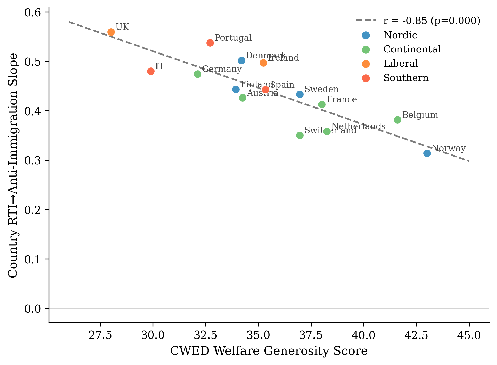
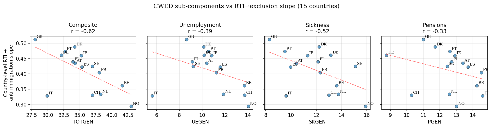
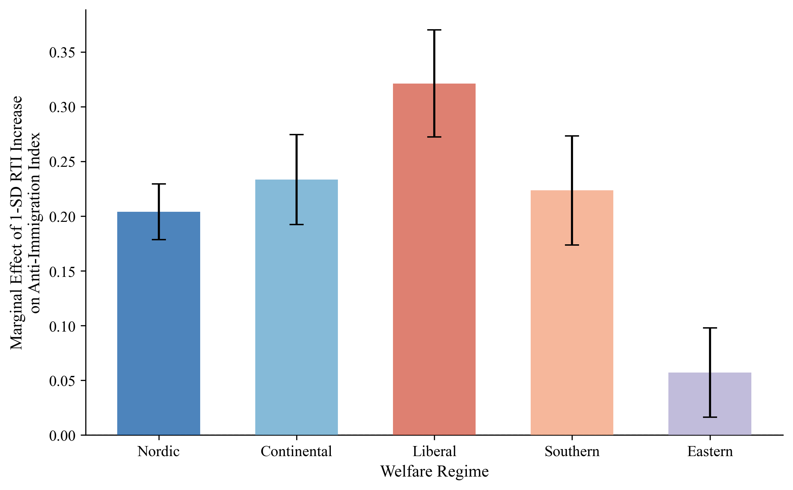

## {.center}

::: {style="text-align: center;"}

# Dignity Is a Baseline {.larger}

### Welfare Institutions and the Asymmetric Politics of Economic Disruption

 

**Ben Smart**

University of Copenhagen — Department of Economics

*Welfare State Seminar — 4 May 2026*

:::

::: {.notes}
[20-second open]

Good afternoon. The paper is called "Dignity Is a Baseline." The thirty-second
version is this: workers exposed to automation are more anti-immigration than
their material interests would predict, the gap is bigger in some welfare states
than in others, and the conventional explanation — that more generous welfare
buffers the political backlash — is wrong about the mechanism in a specific and
testable way. The mechanism is asymmetric. I'll show you why.
:::

---

## The puzzle

::: {.incremental}

- Workers in routine-task-intensive (RTI) occupations across Europe disproportionately support populist radical right parties (Gingrich 2019; Kurer 2020; Im et al. 2019; Autor et al. 2020)

- Cross-national variation: the same automation exposure converts into anti-immigration sentiment more readily in some welfare states than in others

- Standard reading: welfare generosity buffers the political backlash. **Spend more, get less populism.**

- Today's argument: this account is missing the mechanism it claims to describe

:::

::: {.notes}
[Pace: 1-2 min]

Set up the empirical regularity, then the puzzle. RTI workers vote radical right
disproportionately — well documented. The cross-national variation is also
documented. The dominant interpretation is the buffering account: generous
welfare states see less populism because they cushion the dislocated.

I'm going to argue this account is wrong about the mechanism. Not wrong that
welfare matters — wrong about HOW welfare matters. And the consequences for
how we think about welfare-state design are real.
:::

---

## What the buffering account predicts

> Following Ruggie's (1982) embedded liberalism bargain, generous compensation should dampen the political insecurity produced by economic openness.

::: {.fragment}

**Operative variable: quantity.**

- More spending → less populism
- Symmetric: damage and repair are mirror images of each other
- Compensation works by replacing income lost to disruption

:::

::: {.notes}
[1 min]

The buffering reading rests on Ruggie's embedded liberalism. Compensation is a
quantity. The mechanism is symmetric — what damages is undone by what compensates.
The variable is how much the welfare state spends.

The quantity assumption is what I want to challenge. Spend more, get less
populism — this turns out to fit the data poorly.
:::

---

## Three streams of evidence against buffering

::: {.columns}

::: {.column width="33%" .fragment}

### Compensation that doesn't work

**Gingrich (2019)** finds workers exposed to automation are *not* less likely to vote populist in countries with more generous early retirement, more in-kind spending, or more protective regulation.

:::

::: {.column width="33%" .fragment}

### Compensation that backfires

**Stutzmann (2025)** examines Germany's coal phase-out. Substantial compensatory investment. Material conditions held. Affected municipalities showed *higher* abstention and *lower* support for the issue-owning party.

:::

::: {.column width="33%" .fragment}

### Compensation that is resisted

**Pelc (2025)** shows workers refuse to be compensated out of work *even when the compensation fully replaces their income*. Form, source, and meaning of compensation matter independently of material content.

:::

:::

::: {.notes}
[2 min — speak to each column for ~30 sec]

Three different research designs, three different findings, all pointing the
same direction. Gingrich's cross-national analysis: more generous welfare
states do not show weaker automation-to-populism effects. Stutzmann on the
German coal phase-out: a textbook case of policy compensation that backfired
politically. Pelc's experimental work: workers reject compensation that
should, materially, satisfy them.

The pattern across these is that material compensation is doing less of the
political work than the buffering model assumes.
:::

---

## Kurer (2020) names the tension

> "When relative societal decline rather than material hardship are at the heart of socially conservative resentment, traditional welfare policy may be an insufficient response to satisfy exposed workers and hence an ineffective remedy to counter the ascent of right-wing populist movements."

::: {.fragment}

**Kurer & Palier (2019):**

> "This appeal to personal dignity is key to winning routine workers' support. Perhaps even more than social protection, they demand economic *and* cultural protection."

:::

::: {.fragment}

**Gidron & Hall (2017, p.26):**

> Right-populist voters "care as much, or even more, about recognition as about redistribution."

:::

::: {.notes}
[1 min]

Three quotes from major contributions in the literature, all pointing at the
same thing: redistribution and recognition aren't fungible. The buffering
framework treats them as if they were. They aren't, and the empirical record
keeps showing this.

This is where my argument enters. I take Kurer's claim literally — that
traditional welfare may be an insufficient response — and ask which
institutional dimension actually does the political work.
:::

---

## The argument in one slide

### Welfare institutions are *asymmetric* in their political effects

::: {.fragment}

They can fail politically — by damaging the self-concept of vulnerable workers — through a cascade of:

::: {.incremental}

1. **Identity switching** (Bonomi, Gennaioli & Tabellini 2021)
2. **Misattribution** (Gallego & Kurer 2022)
3. **Defensive othering** (Wagner 2022; Patrick 2016)

:::

:::

::: {.fragment}

They cannot, by symmetric operation, succeed.

> **Dignity is a baseline good. Its absence damages. Its presence clears the ground for solidarity without producing it.**

:::

::: {.notes}
[2 min — this is the central conceptual slide]

This is the argument. Welfare institutions can fail politically through a
specific cascade — identity switching, misattribution, defensive othering. I'll
walk through each in a moment.

The key claim is asymmetric. The mechanism that damages is real and observable.
The mirror-image protective mechanism — where dignity-preserving welfare
produces solidarity — is not. In my data and in others'.

That last sentence is the paper's title in compressed form. Dignity is a
baseline good. Its absence damages. Its presence clears ground for solidarity
that other things have to build.
:::

---

## Why welfare, and not something else

::: {.incremental}

- Many institutions shape identity: media environments, religious traditions, class structures
- Why isolate welfare?

- **Welfare is the single state domain where economic vulnerability and institutional treatment meet at the same moment**

- When a worker encounters the welfare state, the institution allocates resources *and* renders judgement about their claim to those resources, in the same act

- Courts judge but rarely allocate. Markets allocate without judgement. Religious institutions judge but cannot compel.

- **Only welfare does both. At the point of maximum material dependence.**

:::

::: {.notes}
[1 min]

The objection one would make at this stage is that lots of institutions shape
identity. Why is welfare special?

Welfare is the one state domain where economic vulnerability meets institutional
treatment in the same act. A worker encountering the welfare state is being
allocated resources AND being judged about their claim to them, simultaneously.
That joint operation is unusual.

This is what makes welfare uniquely load-bearing as a communicator of citizen
worth. It's what Wagner's recipients are hearing when they "internalize
deservingness criteria." It's what makes dignity an institutional outcome, not
just a personal one.
:::

---

## The damage cascade

::: {.columns}

::: {.column width="33%"}

### 1. Identity switches

Bonomi et al. (2021): individuals move from class to cultural identity when class identity is degraded.

Stigmatising welfare implementation degrades class identity *directly* — accelerating the switch.

:::

::: {.column width="33%" .fragment}

### 2. Grievances misattribute

Once cultural identity is in charge, frustration finds available scapegoats.

Wu (2022): workers at higher automation risk oppose immigration but show no different technology preferences.

The misdirection has *no protective analogue*.

:::

::: {.column width="33%" .fragment}

### 3. Othering turns defensive

Patrick (2016): UK benefit claimants shore up their own deservingness through critique of those below them, using the welfare system's own criteria.

Wagner (2022): "kicking down."

:::

:::

::: {.fragment}

**Endpoint (Busemeyer, Rathgeb & Sahm 2023):** the *particularistic-authoritarian* welfare preference — pro-workfare, anti-poor, anti-social-investment.

:::

::: {.notes}
[2 min]

Three steps in sequence. Identity switches first — class to cultural. Then
grievances misattribute — frustration that should target the actual cause of
vulnerability gets pointed at immigrants. Then othering turns defensive — the
worker shores up their own deservingness on critique of those below them.

The cascade ends in what Busemeyer and colleagues call the
"particularistic-authoritarian" preference. Pro-workfare, anti-poor,
anti-social-investment. The political programme of a self-concept the welfare
state has helped construct.

What's important about this slide: each step has a documented empirical
literature, but no one has connected the chain. Connecting them — with welfare
design as the upstream condition — is one of the paper's contributions.
:::

---

## Why no mirror image

::: {.fragment}

**Three asymmetries, none with a symmetric counterpart**

:::

::: {.fragment}

**Loss aversion (Kahneman & Tversky 1979).** Stigmatising encounters register as losses; dignity-preserving ones don't register as gains of equivalent magnitude. Damage mobilises; the absence of damage tends not to.

:::

::: {.fragment}

**Status is positional.** What right-populist voters want is recognition in the relational sense, and recognition cannot be redistributed without losses to the currently-recognised (Gidron & Hall 2017). Dignity-preserving welfare *removes an obstacle* to inclusive solidarity. It does not, by itself, *construct* inclusion.

:::

::: {.fragment}

**Defensive othering is costly to reverse.** Identity investments are not undone by changing the institutional environment alone. Pierson's (1994) positive feedback runs forward into supportive constituencies; the damage cascade runs forward into a population that has forgotten the position it now defends was constructed for it.

:::

::: {.notes}
[2 min]

Three reasons the mechanism is one-way, not symmetric.

First, loss aversion. Damage is psychologically heavier than equivalent
non-damage. This applies to dignity shocks just as it applies to material ones.

Second, status is positional. Recognition can't be redistributed the way money
can — relational goods don't add to a fixed pool. Dignity-preserving welfare
clears space for inclusive solidarity but doesn't itself produce the inclusion.

Third — and the one I find theoretically most interesting — defensive othering,
once committed to, is costly to reverse. The cascade isn't just additive. It's
identity-investing. Pierson's classic positive-feedback story is forward into
support; the damage cascade is forward into opposition that gets harder to
reverse with each iteration.

The implication: even if you fix the institutions, the cascade has already
made commitments that institutions alone cannot undo.
:::

---

## Empirical setup

::: {.columns}

::: {.column width="50%"}

### Data

- **European Social Survey** rounds 6–9 (2012–2018)
- **34 countries**, N=188,764
- **15 Western European countries** in the welfare-quality analysis (CWED)

### Key variables

- RTI: routine task intensity (Goos, Manning & Salomons 2014; Autor, Levy & Murnane 2003)
- Anti-immigration: 3-item index (α=0.864)
- Welfare context: regimes; spending (ALMP); decommodification (CWED)

:::

::: {.column width="50%"}

### Approach

- **Cross-level interactions:** RTI × Welfare → attitudes
- Country-wave fixed effects, cluster-robust SEs
- Random-slope mixed models for cross-national heterogeneity
- 15-country matched sample for ALMP/CWED comparison
- Cross-sectional design — claim is consistency, not causation

:::

:::

::: {.notes}
[1 min]

Quick description of the data. ESS waves 6 to 9, 34 countries. The headline
analysis is a cross-level interaction — RTI predicting anti-immigration
attitudes, with the slope conditional on welfare context. I run regimes,
spending, and decommodification as alternative welfare measures.

Cross-sectional design — I'm honest about that in the paper. I can show the
pattern is consistent with the asymmetric mechanism; I can't establish
causation here. The thesis follow-up does that with Danish registry data.
:::

---

## ALMP vs CWED — the headline

{width=80% fig-align="center"}

::: {.fragment}

**Same 15 countries, two welfare measures:**

- **ALMP spending:** r = +0.01 (n.s.) → spending effort doesn't predict the slope
- **CWED decommodification:** r = −0.85 (p<0.001) → decommodification accounts for 72% of cross-national variation in how strongly RTI converts into exclusion

:::

::: {.notes}
[2 min — the empirical highlight]

This is the paper's most important empirical contrast. Same fifteen Western
European countries, two ways of measuring welfare. Active labour market policy
spending — what most of the buffering literature uses as its measure of
welfare effort. CWED decommodification — the degree to which the welfare
state lets you sustain yourself without market employment.

ALMP spending: essentially zero correlation with how strongly automation
exposure converts into exclusion. Spending more on labour market policies has
nothing to do with the cross-national pattern.

CWED decommodification: r equals negative point eight five. Seventy-two percent
of the cross-national variation. The line you're looking at is what the
asymmetric mechanism predicts and what the buffering account cannot explain.

What's the difference? ALMP captures effort. You can spend a lot on punitive
workfare. CWED captures decommodification — what the welfare state lets you
have, not what it costs to provide. The dignity dimension travels along the
second variable.
:::

---

## Decomposition: which decommodification dimension matters?

::: {.columns}

::: {.column width="60%"}

{width=100%}

:::

::: {.column width="40%"}

### Individual-level interactions

| Component | β | p |
|-----------|---|---|
| **Unemployment** | **−0.053** | **<0.001** |
| Sickness | −0.037 | 0.003 |
| Pensions | −0.019 | 0.066 |
| Composite | −0.051 | <0.001 |

::: {.fragment}

**Predicted ordering: UE > SK > PEN.**

**Observed ordering at individual level: UE > SK > PEN.** ✓

The damage cascade fires through the *point of economic vulnerability*.

:::

:::

:::

::: {.notes}
[1.5 min — the new finding]

This is the new analysis I ran this week. The composite CWED hides three
sub-components: unemployment generosity, sickness generosity, pension
generosity. Theory predicts unemployment should drive the result — that's where
automation-exposed workers actually meet the welfare state.

Individual-level interaction: unemployment generosity, beta minus zero point
zero five, p less than point zero zero one. Sickness intermediate. Pensions
weakest, marginally significant only.

Theory holds at the test that matters: the institutional channel runs through
the point of economic vulnerability, not through welfare expenditure in the
abstract.

For thesis design, this matters: the within-Denmark test should focus on
unemployment benefit reforms — the 2003, 2006, and 2013 activation reforms.
Pension reforms should NOT show damage signatures of the same magnitude.
:::

---

## The asymmetric confirmation

### Same data, opposite outcome

| Outcome | RTI × Liberal interaction | p |
|---------|---------------------------|---|
| **Anti-immigration** | **β = +0.127** | **0.003** ✓ |
| Redistribution support | β = +0.011 | 0.285 (n.s.) |

::: {.fragment}

**The exclusion side is robust. The solidarity side is null.**

- Welfare context cleanly attenuates the conversion of vulnerability into exclusion
- Welfare context does *not* detectably moderate the conversion of the same vulnerability into solidarity
- Supplementary ISSP test on different sample, different outcome, different time period: same null

:::

::: {.fragment}

This is what the asymmetric mechanism predicts.

:::

::: {.notes}
[1 min]

The same data tested two ways. RTI predicts anti-immigration attitudes more
strongly in Liberal regimes than Nordic ones — the interaction is significant
across every specification. RTI predicts slightly higher redistribution support
across all regimes — but the cross-regime variation in that pathway is small,
non-significant, and in the wrong direction.

Welfare context attenuates conversion into exclusion. It does not detectably
moderate conversion into solidarity.

Two ways to read the null. As a measurement limitation — single-item scales,
panel limitations. Or as a substantive confirmation — the mechanism IS
asymmetric. The supplementary ISSP analysis on different data with a different
outcome returns the same null. I take the substantive reading. It's what the
theory predicts.
:::

---

## Implications

::: {.incremental}

- **For welfare-state theory:** the political consequences of welfare design travel along *what welfare communicates*, not *how much welfare spends*

- **For the cultural-vs-economic debate:** cultural backlash isn't a rival explanation to economic disruption — it's what economic disruption looks like, cross-nationally, where welfare institutions are less decommodifying

- **For policy:** dignity-preserving welfare is necessary for solidarity but not sufficient. Active solidarity requires political work that welfare design alone cannot do

- **For thesis follow-up:** Danish registry data on individuals before and after the 2003/2006/2013 activation reforms — testing within-individual whether conditionality shocks produce damage signatures

:::

::: {.notes}
[1 min]

Four implications.

First, welfare-state theory: the dimension along which welfare's political
effects travel is what it communicates, not how much it spends. Decommodification
is a measure of the former. Spending is a measure of the latter.

Second, the cultural-vs-economic debate. People keep arguing about whether
populism is fundamentally about culture or about economics. My answer is: this
distinction is misleading. Cultural backlash is what economic disruption looks
like cross-nationally, when welfare institutions don't preserve recognition.
The "cultural" reading isn't a rival; it's what the economic story looks like
where the institutions are less decommodifying.

Third, policy. Dignity-preserving welfare is a baseline good. It's necessary
for solidarity but doesn't itself construct it.

Fourth, where this goes next. Danish registry data lets me test the
within-individual claim — that conditionality reforms produce damage signatures
in panel attitudes. That's the thesis.
:::

---

## {.center}

::: {style="text-align: center;"}

# Dignity is a baseline {.larger}

 

Its absence damages.

Its presence clears the ground for solidarity.

It does not, by itself, produce solidarity.

 
 

**Thank you.**

::: {style="font-size: 0.7em; color: #666;"}

ben.smart\@econ.ku.dk

:::

:::

::: {.notes}
[Closing — 30 seconds]

The line that holds the paper together. Dignity is a baseline good. Its absence
damages. Its presence clears ground for solidarity that has to be built on top,
by other means.

The asymmetric mechanism is the technical version. The line is the moral version.
Both are saying the same thing.

Thank you. Happy to take questions.
:::

---

## {visibility="uncounted"}

# Backup slides

::: {.notes}
For Q&A. Don't show unless asked.
:::

---

## Backup: regime descriptive results {visibility="uncounted"}

{width=80% fig-align="center"}

| Regime | RTI → anti-immig slope |
|--------|------------------------|
| Liberal (UK, IE) | β = 0.512 |
| Southern (ES, IT, PT, CY) | β = 0.462 |
| Continental (DE, FR, AT, BE, NL, CH) | β = 0.443 |
| Nordic (DK, SE, NO, FI, IS) | β = 0.413 |
| Eastern | β = 0.263 |

---

## Backup: marginal effects {visibility="uncounted"}

{width=70% fig-align="center"}

A 1-SD increase in RTI is associated with:

- **0.32** additional scale points of anti-immigration sentiment in Liberal regimes
- **0.20** in Nordic regimes
- Gap: significant and substantively meaningful

---

## Backup: addressing Burgoon & Schakel (2022) {visibility="uncounted"}

**They find:** welfare generosity dampens anti-globalisation nationalism in European party platforms.

**Apparent contradiction with my null on ALMP — resolved by unit of analysis:**

- B&S measure platform language at the **party** level
- I measure attitudinal slopes at the **individual** level conditional on RTI exposure
- Mechanisms differ: elite incentives + coalition arithmetic vs. institutional encounter + self-concept

**Both can be true.** Welfare generosity at scale may dampen the *supply* of anti-globalisation rhetoric in party systems while the *demand* for exclusionary attitudes among vulnerable workers responds to a different welfare dimension entirely.

---

## Backup: Denmark complication {visibility="uncounted"}

Despite high CWED generosity, Denmark shows steeper RTI → exclusion slope (β=0.50) than Finland, Sweden, or Norway.

**Reading: not an anomaly. Confirmation.**

Danish "flexicurity" combines generous benefits with high labour market flexibility and active job search requirements — *generous in transfers but demanding in activation*.

The asymmetric mechanism predicts:
- Conditionality and surveillance damage the self-concept *even when transfer levels are high*
- Conditionality is what communicates suspicion, not (only) thinness of provision

Robustness: country-level finding survives all single-country exclusions. r=−0.717 even with both highest-leverage observations dropped (p=0.006).

---

## Backup: limitations {visibility="uncounted"}

::: {.incremental}

- **Cross-sectional design** cannot establish temporal ordering. Within-individual variation in dignity exposure is the test the registry-based follow-up will run.

- **Country-level confounders** remain: Nordic countries with high CWED also have higher social trust, stronger unions, PR systems, lower ethnic heterogeneity. Macro-controls (GDP growth, Gini) address macroeconomic confounders but not these deeper institutional correlates.

- **N=15 country-level observations** for the headline correlation. Individual-level Model 3 (β=−0.06, p=0.015, N=82k) is the more defensible test.

- **Loss aversion claim** in §III.D applies behavioural economics by analogy to dignity shocks. The supporting empirical work (Kurer & van Staalduinen 2022) is consistent but does not test it directly.

:::
